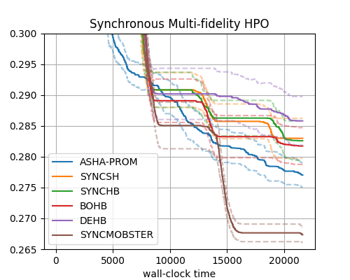

# Multi-Fidelity HPO: Comparison of Methods

In this section, we present an empirical comparison of all methods discussed
in this tutorial. The methodology of our study is as follows:

* We use the NASBench-201 benchmark (CIFAR100 dataset)
* All methods are run with a `max_wallclock_time` limit of 6 hours (or 21600
  seconds). We plot minimum validation error attained as function of
  wallclock time (which, in our case, is simulated time)
* Results are aggregated over a number of repetitions. The number of
  repetitions is 50 for SYNCSH, SYNCHB, BOHB, DEHB, ASHA-STOP, ASHA-PROM,
  ASHA6-STOP and SYNCMOBSTER, while MOBSTER-JOINT, MOBSTER-INDEP,
  HYPERTUNE1-INDEP, HYPERTUNE4-INDEP and HYPERTUNE-JOINT are repeated 30 times.
  Figures plot the interquartile mean in bold and a bootstrap 95% confidence
  interval for this estimator in dashed lines (the IQM is a robust estimator
  of the mean, but depends on more data than the median)
* SYNCSH, ASHA-STOP, ASHA-PROM, MOBSTER-JOINT, MOBSTER-INDEP, HYPERTUNE1-INDEP
  use 1 bracket, HYPERTUNE4-INDEP, HYPERTUNE-JOINT use 4 brackets, and SYNCHB,
  BOHB, DEHB, SYNCMOBSTER use the maximum of 6 brackets
* In SYNCSH, SYNCHB, ASHA-STOP, ASHA-PROM, ASHA6-STOP, new configurations are
  drawn at random, while BOHB, SYNCMOBSTER, MOBSTER-JOINT, MOBSTER-INDEP,
  HYPERTUNE1-INDEP, HYPERTUNE4-INDEP, HYPERTUNE-JOINT are variants of Bayesian
  optimization. In DEHB, configurations in the first bracket are drawn at
  random, but in later brackets, they are evolved from earlier ones
* ASHA-STOP, ASHA6-STOP use early stopping, while SYNCSH, SYNCHB, BOHB,
  SYNCMOBSTER, ASHA-PROM, MOBSTER-JOINT, MOBSTER-INDEP, HYPERTUNE1-INDEP,
  HYPERTUNE4-INDEP, HYPERTUNE-JOINT use pause-and-resume. DEHB is a
  synchronous method, but does not resume trials from checkpoints (except in
  the very first bracket)

Here are results, grouped by synchronous decision-making, asynchronous
decision-making (promotion type), and asynchronous decision-making (stopping
type). ASHA-PROM results are repeated in all plots for reference.

|  |
|:-----------------------------------------------------|
| Synchronous Multi-fidelity HPO                       |

|  |
|:------------------------------------------------------|
| Asynchronous Multi-fidelity HPO (promotion)           |

|  |
|:------------------------------------------------------|
| Asynchronous Multi-fidelity HPO (stopping)            |

These results are obtained on a single benchmark with a rather small
configuration space. Nevertheless, they are roughly in line with results
we obtained on a larger range of benchmarks (CITATION?). A few conclusions
can be drawn, which may help readers choosing the best HPO method and its
configuration for their own problem.

* Asynchronous methods outperform synchronous ones in general, in particular
  when it comes to any-time performance. A notable exception (on this
  benchmark) is SYNCMOBSTER, which performs en par with the best asynchronous
  methods.
* Among the synchronous methods, SYNCMOBSTER performs best, followed by BOHB.
  SYNCHB and SYNCSH perform very similar. The performance of DEHB is
  somewhat disappointing on this benchmark. Note that these results have been
  obtained with one-hot encoding of the categorical HPs, leading to a
  30-dimensional input space. The DEHB authors suggest to use an ordinal
  encoding instead. TODO: Either add additional results, or remove this!
* The best-performing methods on this benchmark are MOBSTER-JOINT and
  HYPERTUNE1-INDEP, with HYPERTUNE4-INDEP a close runner-up. For MOBSTER,
  the joint multi-task surrogate model should be preferred, while for
  HYPERTUNE, the independent GPs model works better.
* On this benchmark, moving to multiple brackets does not pay off for the
  asynchronous methods. However, on benchmarks where the choice of
  $r_{min}$ is more critical, moving beyond successive halving can
  be beneficial (CITATION?). In such cases, we currently recommend to use
  HYPERTUNE-INDEP, whose adaptive weighting and bracket sampling is clearly
  more effective than simpler heuristics used in Hyperband or BOHB
